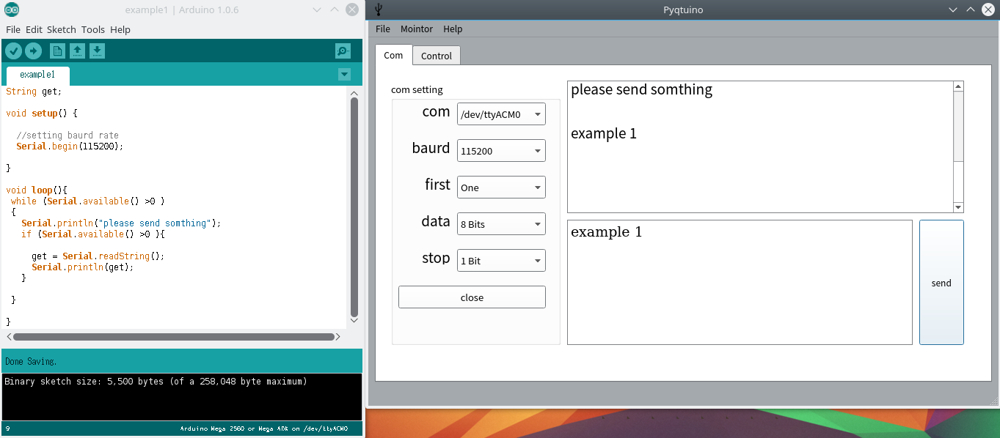

Arduino Example
===

use Arduino Ide upload the code in the example code.



##Windows system

you need to check you COM Port and setup the correct number in Pyquino.

##Linux system

you can use this bash to checkout the controller .

```bash
#!/bin/bash

for sysdevpath in $(find /sys/bus/usb/devices/usb*/ -name dev); do
    (
        syspath="${sysdevpath%/dev}"
        devname="$(udevadm info -q name -p $syspath)"
        [[ "$devname" == "bus/"* ]] && continue
        eval "$(udevadm info -q property --export -p $syspath)"
        [[ -z "$ID_SERIAL" ]] && continue
        echo "/dev/$devname - $ID_SERIAL"
    )
done
```

On my system ,the result in the following:

```bash
/dev/input/event14 - 1bcf_USB_Optical_Mouse
/dev/input/mouse1 - 1bcf_USB_Optical_Mouse
/dev/input/event4 - Logitech_USB_Optical_Mouse
/dev/input/mouse0 - Logitech_USB_Optical_Mouse
/dev/ttyACM0 - Arduino__www.arduino.cc__0042_75439313637351511181
/dev/sdb - Generic-_Compact_Flash_20070818000000000-0:0
/dev/sdc - Generic-_SM_xD-Picture_20070818000000000-0:1
/dev/sdd - Generic-_SD_MMC_20070818000000000-0:2
/dev/sde - Generic-_MS_MS-Pro_20070818000000000-0:3

done
```

you can see the controller in ttyACM0,setup the Pyquino in tty/ACM0 

can get communcation with Arduino controller    


